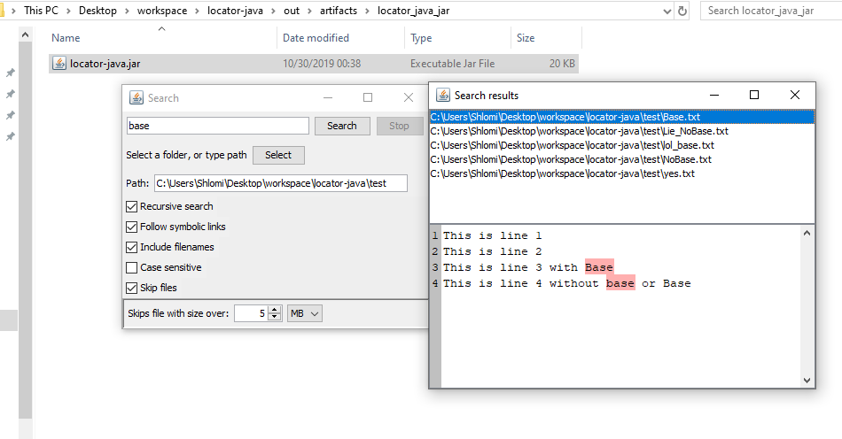

# Search
Search is a simple tools for searching a text or filename in your system.

It has advance features and works is cross-platform compatiable.
 
My goal is to create GUI tools suite for Linux sysadmins / regular users who don't want to use the terminal all the time or to do something quickly.

